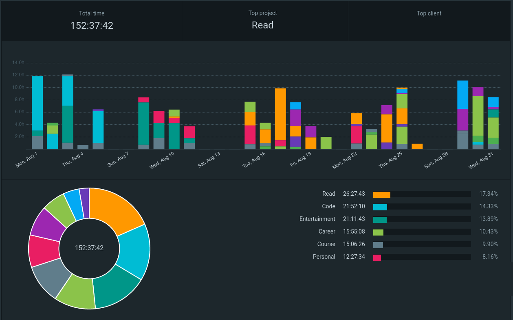

# Waybar-Clockify [](LICENSE) 

> Track and display [Clockify](https://clockify.me/)'s time entry at `Waybar`

https://user-images.githubusercontent.com/57322459/187881265-150b0227-c0b4-41c7-97d7-c203fbcebb27.mp4

## Description

`Waybar-Clockify` is a simple wrapper between [clockify-cli](https://github.com/lucassabreu/clockify-cli) and [timewarrior](https://github.com/GothenburgBitFactory/timewarrior).

### Why?

I love `timewarrior`, but I find the summary and report functionalities lacking, while `Clockify` offers rich reports and time analysis:



Fortunately, we have `clockify-cli` which offers amazing integration with `Clockify`. Hence the birth of `Waybar-Clockify`.

## Getting Started

### Dependencies

- [Waybar](https://github.com/Alexays/Waybar)
- [timewarrior](https://github.com/GothenburgBitFactory/timewarrior)
- [clockify-cli](https://github.com/lucassabreu/clockify-cli)
- [rofi](https://github.com/davatorium/rofi)
- [jq](https://github.com/stedolan/jq)
- [fzf](https://github.com/junegunn/fzf) (optional if you want to control through terminal)

### Installation

1. Clone this repository: `git clone https://github.com/kohane27/Waybar-Clockify.git`

2. Put the directory `src/Waybar-Clockify` under `~/.config/waybar/scripts/Waybar-Clockify`:

```
.
├── config
├── scripts
│   ├── custom-script.sh
│   └── Waybar-Clockify
│       ├── click.sh
│       ├── main.sh
│       └── stop.sh
│       ├── clockify-tags.txt
└── style.css
```

3. Make `click.sh`, `main.sh` and `stop.sh` executable: `chmod +x click.sh main.sh stop.sh`

4. Add `Waybar-Clockify` module to `~/.config/waybar/config`:

```bash
    "custom/Waybar-Clockify": {
    "format": " {} ",
    "exec": "~/.config/waybar/scripts/Waybar-Clockify/main.sh",
    "on-click": "~/.config/waybar/scripts/Waybar-Clockify/click.sh",
    "on-click-right": "~/.config/waybar/scripts/Waybar-Clockify/stop.sh",
    },
```

5. Add the module to whichever modules you want the timer to appear. In this example it's `modules-right`:

```
    "modules-right": [
        "custom/Waybar-Clockify",
        "cpu",
        "memory"
    ],
```

6. Restart `Waybar` and the timer should appear

7. (Optional) Add the following two shell functions to `~/.bashrc` or `~/.zshrc`:

```bash
ti() {
  # no running instance
  if [[ "$(timew get dom.active)" == 0 ]]; then
    timew start > /dev/null 2>&1
    print -z timew tag @1 \'"$(cat <~/.config/waybar/scripts/Waybar-Clockify/clockify-tags.txt | fzf)"\'
  fi
  # already have a running instance with tag(s)
  if [[ "$(timew get dom.active)" == 1 ]] && [[ "$(timew get dom.active.tag.count)" == 1 ]]; then
    return
  fi
}

to() {
    ~/.config/waybar/scripts/Waybar-Clockify/stop.sh
}
```

You may choose whatever function command names you want. For example, if you're used to [timewarrior: zsh plugin for timewarrior](https://github.com/svenXY/timewarrior), then you can use the default `twa` and `two`.

## Usage

**Note: I recommend getting familiar with `clockify-cli` and `timewarrior` before using.**

There are two main ways to interact with `Waybar-Clockify`:

### 1. Only through `Waybar`

https://user-images.githubusercontent.com/57322459/187881265-150b0227-c0b4-41c7-97d7-c203fbcebb27.mp4

1. Left click to start the timer
2. Click on a predefined tag in `clockify-tags.txt` through `rofi`
3. Right click to stop the timer

### 2. Only through terminal

https://user-images.githubusercontent.com/57322459/187881260-48ad1ad1-7964-4a61-8b84-2f1fb8876fc0.mp4

If you've added the optional shell functions to `~/.bashrc` or `~/.zshrc` (step 7 above):

1. Use the command `ti` to start the timer
2. Choose a predefined tag in `clockify-tags.txt` through `fzf`
3. Use the command `to` to stop the timer

Additionally, you could start `Waybar-Clockify` in the terminal and stop in `Waybar`, or start in `Waybar` and stop in the terminal.

### Caveats

#### 1. Tags need to already exist in `Clockify`

Inside `clockify-tags.txt`, you'll find the following samples:

```
{"p": "Code","t":["clientA","career"], "d": "projectA"}
{"p": "Code","t":["clientB","career"], "d": "projectB"}
{"p": "Entertainment","t": ["youtube"], "d": ""}
```

- `p`: project
- `t`: tags
- `d`: description

Each key corresponds to PROJECT, TAGS and DESCRIPTION in `clockify-cli`:

```
❯ clockify-cli report
+--------------------------+---------------------+---------------------+---------+---------------+-------------+------+------------------------------------+
|            ID            |        START        |         END         |   DUR   |    PROJECT    | DESCRIPTION | TASK |                TAGS                |
+--------------------------+---------------------+---------------------+---------+---------------+-------------+------+------------------------------------+
| 63121910b456dc322924eb1f | 2022-09-01 08:00:00 | 2022-09-01 09:00:00 | 1:00:00 | Code          | projectA    |      | clientA (630328ec899ba763d36b39d7) |
|                          |                     |                     |         |               |             |      | career  (630106dd96dd4c674e51a45a) |
+--------------------------+---------------------+---------------------+---------+---------------+-------------+------+------------------------------------+
| 63131a977f07da44c10f6a21 | 2022-09-01 09:52:59 | 2022-09-01 10:49:00 | 0:56:01 | Entertainment | cat vid     |      | youtube (6306445eb59c366b3eaz4280) |
+--------------------------+---------------------+---------------------+---------+---------------+-------------+------+------------------------------------+
| TOTAL                    |                     |                     | 1:56:01 |               |             |      |                                    |
+--------------------------+---------------------+---------------------+---------+---------------+-------------+------+------------------------------------+
```

You need to make sure `p`(`project`) and `t`(`tags`) fields exist in `clockify`, or else `clockify-cli` will fail to send the time entry to `Clockify`. In the above example, the projects `Code` and `Entertainment`, and the tags `clientA`, `clientB`, `youtube` need to exist in `Clockify`.

To see the projects available `clockify-cli project list --not-archived --csv`

To see the tags available: `clockify-cli tag`

#### 2. Beware of modification of `timewarrior` tag fields

I use `timewarrior` as a medium between `Waybar-Clockify` and `clockify-cli`. The `timewarrior` tag field is converted to a json for `clockify-cli` to consume. The tag field will become like the following:

```
inc 20220831T091819Z - 20220831T091822Z # "{\"p\": \"Entertainment\",\"d\": \"\",\"t\": [\"youtube\"]}"
inc 20220831T133109Z - 20220831T133121Z # "{\"p\": \"Code\",\"t\": [\"code\",\"career\"], \"d\": \"clientA\"}"
```

Please take into acount of this modification of `timewarrior` data before using `Waybar-Clockify`. Back up your `.timewarrior` data.

## How `Waybar-Clockify` works

The backbone of time tracking is done by `timewarrior`, so any `timewarrior` commands like `cancel`, `continue`, `lengthen`, `shorten` still work.

`Waybar` displays the latest time tracked by `timewarrior`, effectively `timew get dom.active.duration`.

When you left-click the Waybar module or use the command `to`, it'll trigger the follow `clockify-cli` command to communicate with `clockify` API:

```sh
clockify-cli manual \
  --project "$project" \
  --description "$description" \
  --when "$start" \
  --when-to-close "$end" \
  --tag "$tag"
  --interactive=0
```

It's permissive: if no project, description, tags are provided, default values are used, i.e., empty strings.

## Roadmap

- [ ] `fzf`: after selection, move cursor inside `d` field so it's ready for input: `'{"p": "Health","t":["gym","weight", "d": "|"]}'`

## Contributing

Any contributions you make are **greatly appreciated**. If you have a suggestion that would make this better, please fork the repo and create a pull request. You can also open an issue.

1. Fork the Project
2. Create your Feature Branch (`git checkout -b feature/AmazingFeature`)
3. Commit your Changes (`git commit -m 'Add some AmazingFeature'`)
4. Push to the Branch (`git push origin feature/AmazingFeature`)
5. Open a Pull Request

## License

`Waybar-Clockify` is licensed under the MIT license. [See LICENSE for more information](https://github.com/kohane27/Waybar-Clockify/blob/main/LICENSE).

## Acknowledgments

* [Waybar](https://github.com/Alexays/Waybar)
* [timewarrior](https://github.com/GothenburgBitFactory/timewarrior)
* [clockify-cli](https://github.com/lucassabreu/clockify-cli)
* [rofi](https://github.com/davatorium/rofi)
* [fzf](https://github.com/junegunn/fzf)
* [jq](https://github.com/stedolan/jq)

Don't forget to give the project a star! Thanks again!
